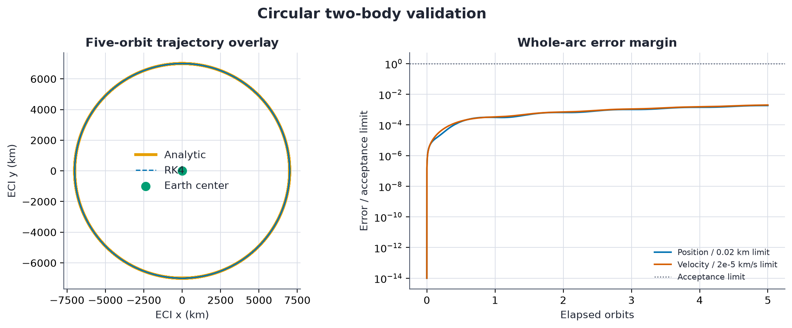
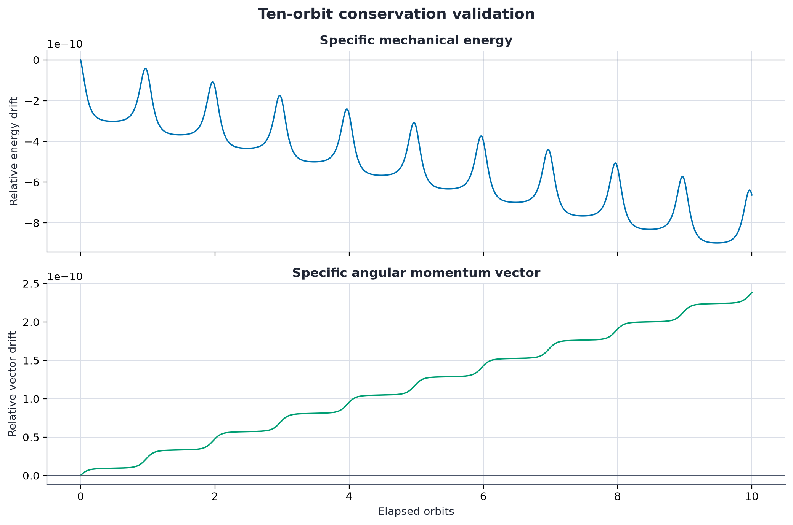
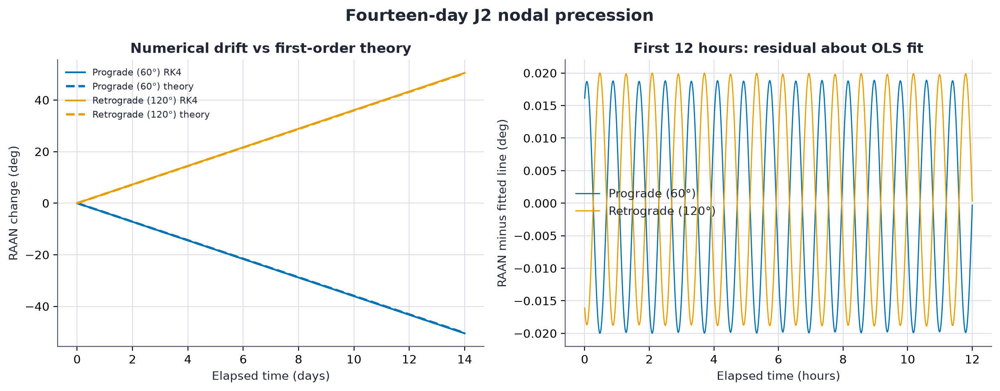

# Orbital Mechanics Simulation

A compact astrodynamics codebase that implements orbital state conversion,
two-body and first-order J2 dynamics, and deterministic fixed-step propagation.
The project treats numerical validation as a deliverable: one command reproduces
the plots and machine-readable evidence shown below.

The implementation uses equations implemented directly with NumPy rather than
an astrodynamics library. It uses no private coursework, proprietary models, or
external trajectory data.

## Validation snapshot

The checked-in evidence exercises the full numerical arc rather than comparing
only the final state.

| Scenario | Acceptance check | Measured result | Status |
|---|---:|---:|:---:|
| Circular two-body, 5 orbits | maximum position error <= 0.02 km | 3.65e-5 km | Pass |
| Circular two-body, 5 orbits | maximum velocity error <= 2e-5 km/s | 3.94e-8 km/s | Pass |
| Eccentric/inclined two-body, 10 orbits | relative energy drift <= 1e-7 | 8.98e-10 | Pass |
| Eccentric/inclined two-body, 10 orbits | relative angular-momentum vector drift <= 1e-7 | 2.38e-10 | Pass |
| J2 prograde and retrograde, 14 days | fitted RAAN rate within 2% of first-order theory | 0.227% error | Pass |

### Analytic circular reference



### Two-body invariants



### J2 nodal precession



## Reproduce the evidence

With [uv](https://docs.astral.sh/uv/):

```bash
uv sync --extra dev
uv run orbit-validate --output-dir artifacts/validation
uv run ruff check .
uv run ruff format --check .
uv run pytest -q
```

Or with Python 3.11 or 3.12 and `pip`:

```bash
python -m venv .venv
source .venv/bin/activate
python -m pip install -e ".[dev]"
orbit-validate --output-dir artifacts/validation
pytest -q
```

The validator returns a nonzero exit code if an acceptance threshold fails. It
produces:

- `validation_summary.json`: constants, scenario configuration, results, and pass/fail decisions
- `validation_metrics.csv`: one row per acceptance metric
- scenario CSV files: the numeric series behind every plot
- colorblind-friendly, headless PNG figures suitable for review or publication

There is no random input. The integrator, step sizes, initial states, constants,
and acceptance thresholds are recorded in the JSON evidence.

## Model

All calculations use kilometers, seconds, and radians. The state is

$$
\mathbf y = \begin{bmatrix}\mathbf r & \mathbf v\end{bmatrix}^{T},
\qquad
\dot{\mathbf y} = \begin{bmatrix}\mathbf v & \mathbf a\end{bmatrix}^{T}.
$$

### Two-body acceleration

The point-mass model is

$$
\mathbf a_{2B} = -\frac{\mu}{r^3}\mathbf r.
$$

For this model, specific mechanical energy and specific angular momentum are
invariants:

$$
\epsilon = \frac{v^2}{2} - \frac{\mu}{r},
\qquad
\mathbf h = \mathbf r \times \mathbf v.
$$

The conservation case starts from an eccentric, inclined orbit and measures
the maximum relative drift in both quantities over ten periods.

### J2 perturbation

The first-order oblateness perturbation is

$$
\mathbf a_{J2} =
\frac{3J_2\mu R_e^2}{2r^5}
\begin{bmatrix}
x\left(5z^2/r^2 - 1\right) \\
y\left(5z^2/r^2 - 1\right) \\
z\left(5z^2/r^2 - 3\right)
\end{bmatrix}.
$$

The numerical RAAN rate is estimated by ordinary least squares over 14 days of
unwrapped osculating RAAN samples. It is compared with the first-order secular
rate

$$
\dot{\Omega} = -\frac{3}{2}J_2 n
\left(\frac{R_e}{p}\right)^2\cos i,
\qquad
n=\sqrt{\frac{\mu}{a^3}},
\qquad
p=a(1-e^2).
$$

Both a 60-degree prograde orbit and a 120-degree retrograde orbit are propagated.
That provides an explicit sign guard: prograde RAAN regresses while retrograde
RAAN advances.

### Integration

Propagation uses the classical fourth-order Runge-Kutta update with a fixed
step. A requested duration must be an integer multiple of the step, so the
implementation never introduces a hidden variable-size final step. This makes
runs deterministic and makes resolution choices visible in the evidence.

## Classical element conversion

The package converts between Cartesian ECI states and elliptic classical
orbital elements:

```python
import numpy as np

from orbital_mechanics import (
    EARTH,
    ClassicalOrbitalElements,
    cartesian_to_elements,
    elements_to_cartesian,
)

elements = ClassicalOrbitalElements(
    semi_major_axis_km=7000.0,
    eccentricity=0.001,
    inclination_rad=np.deg2rad(97.8),
    raan_rad=np.deg2rad(20.0),
    argument_of_periapsis_rad=np.deg2rad(30.0),
    true_anomaly_rad=0.0,
)

position_km, velocity_km_s = elements_to_cartesian(
    elements,
    EARTH.gravitational_parameter_km3_s2,
)
recovered = cartesian_to_elements(
    position_km,
    velocity_km_s,
    EARTH.gravitational_parameter_km3_s2,
)
```

Classical elements are singular for circular and equatorial orbits. This
implementation uses explicit canonical conventions:

- equatorial: RAAN is zero and the remaining longitude follows the sign of
  angular momentum's z component, preserving exact prograde and retrograde states
- circular: argument of periapsis is zero
- circular and inclined: true anomaly carries argument of latitude
- circular and equatorial: true anomaly carries true longitude
- eccentric and equatorial: argument of periapsis carries longitude of periapsis

Tests verify state reconstruction for nonsingular, near-circular, equatorial,
and circular-equatorial cases.

## Project structure

```text
src/orbital_mechanics/
  constants.py       Earth constants in km-s units
  elements.py        COE to/from Cartesian conversion
  dynamics.py        two-body, J2, and conserved quantities
  propagation.py     deterministic fixed-step RK4
  validation.py      scientific cases and artifact generation
  cli.py             orbit-validate command
tests/                unit and end-to-end scientific checks
artifacts/validation/ generated JSON, CSV, and PNG evidence
.github/workflows/    Python 3.11 and 3.12 quality gate
```

## Assumptions and limitations

- The WGS 84 constants are `mu = 398600.4418 km^3/s^2` and
  `Re = 6378.137 km`. The fixed `J2 = 1.08262668e-3` is the EGM96 degree-two
  coefficient rounded to nine significant digits. This study intentionally
  does not model the small time variation of Earth's dynamic oblateness.
- The Cartesian frame is Earth-centered inertial with the J2 symmetry axis
  aligned to inertial z. Earth rotation is not modeled.
- Only bound elliptic classical elements are supported. Parabolic and
  hyperbolic trajectories are rejected.
- The force model omits higher-order gravity, drag, third bodies, solar
  radiation pressure, relativity, and maneuvers.
- Fixed-step RK4 is transparent and useful for this validation study, but it is
  neither adaptive nor symplectic. Long-duration or high-precision mission
  analysis should use an integrator and force model selected for that purpose.
- The J2 comparison is against first-order secular theory. The numerical signal
  includes expected short-period oscillations and higher-order differences.

## Quality gates

GitHub Actions installs from the frozen uv lock, runs lint, formatting, package
builds, and the full test suite on Python 3.11 and 3.12. A separate Python 3.12
job regenerates and byte-compares every checked-in JSON, CSV, and PNG validation
artifact. Tests cover conversion round trips, prograde and retrograde singular
conventions, acceleration signs, invalid inputs, RK4 determinism, whole-arc
analytic error, vector conservation drift, and numerical-versus-theoretical J2
RAAN drift.

## References

- [NGA World Geodetic System 1984](https://earth-info.nga.mil/?action=wgs84&dir=wgs84)
  defines the equatorial semi-major axis and geocentric gravitational constant
  used here.
- [NASA GSFC and NIMA EGM96 coefficient set](https://cddis.nasa.gov/archive/egm96/general_info/egm96_to360.ascii)
  supplies the normalized degree-two coefficient. Converting its
  `C20 = -0.484165371736e-3` gives `J2 = 1.08262668355e-3`, rounded in this model
  to `1.08262668e-3`.
- [NASA/TP-1998-206861](https://ntrs.nasa.gov/citations/19980218814) documents
  the development and conventions of the joint EGM96 gravity model.
- [NASA, Analysis of Opportunities for Intercalibration Between Two Spacecraft](https://ntrs.nasa.gov/citations/20120007107)
  gives the first-order secular J2 RAAN relationship used for the independent
  hard-number and propagation comparisons.

## License

[MIT](LICENSE), Copyright 2026 Charles Lucas.
