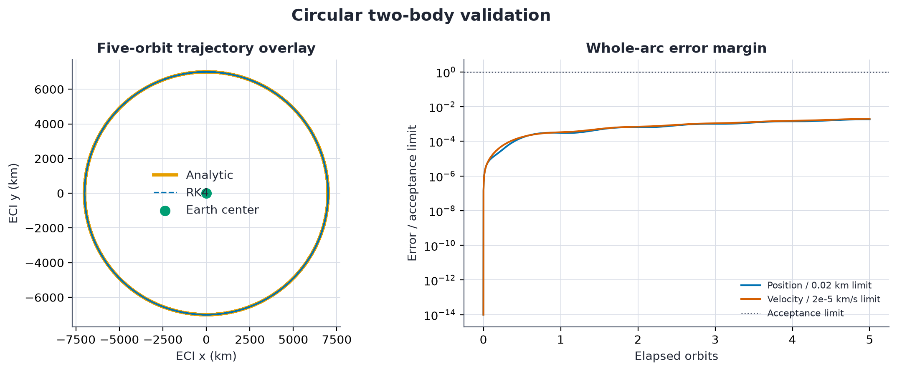
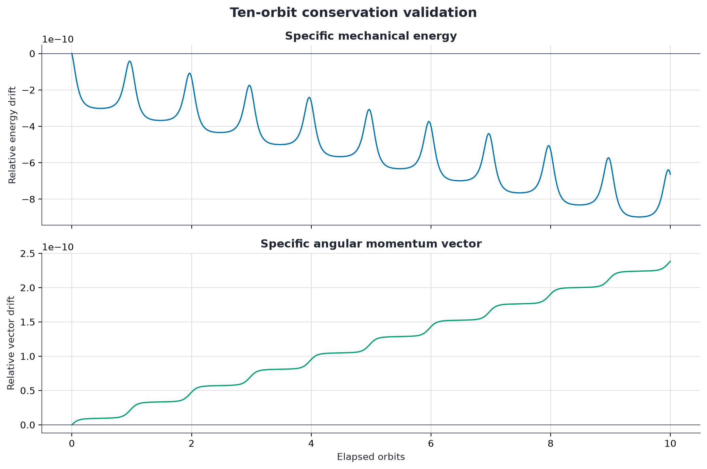
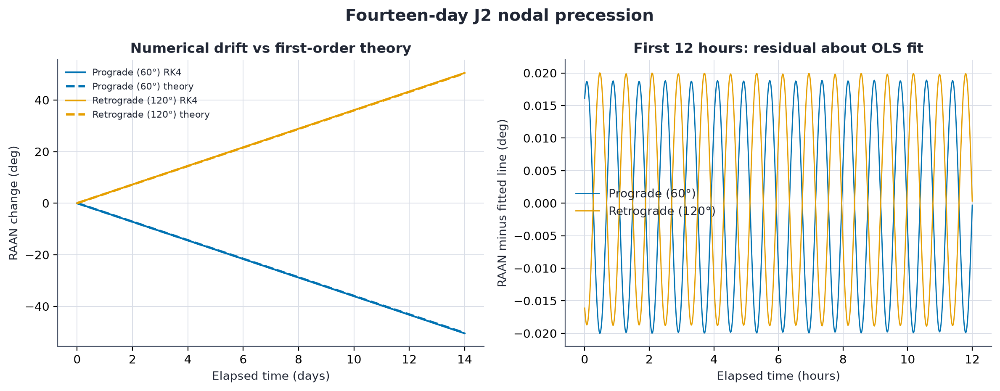

# Orbital Mechanics Simulation

[](https://github.com/charlielucas/orbital-mechanics-simulation/actions/workflows/ci.yml)

This project implements orbital state conversion, two-body and first-order J2
dynamics, and fixed-step propagation. One validation command reproduces the
plots and numeric results shown below.

The equations are implemented directly in NumPy. The project does not depend on
an astrodynamics library, private coursework, proprietary models, or external
trajectory data.

## Interactive explorer

Try the [live Orbital Mechanics Explorer](https://orbital-mechanics-explorer.streamlit.app/).

The Streamlit app adds three guided cases and a bounded custom orbit:

- a circular two-body reference
- an eccentric conservation check
- a seven-day J2 nodal precession comparison
- custom orbital elements with either force model

Each run shows the three-dimensional trajectory, altitude history, and the
diagnostic that fits the selected model. Two-body runs measure relative energy
and angular-momentum drift. J2 runs compare the fitted RAAN rate with first-order
theory. The complete trajectory can be downloaded as CSV.

Run the app with `uv`:

```bash
uv sync --extra app
uv run streamlit run app.py
```

Or with `pip`:

```bash
python -m pip install -e ".[app]"
streamlit run app.py
```

The app uses the package's existing state conversion, acceleration models, and
fixed-step propagator. It does not maintain a separate implementation of the
physics.

## Validation snapshot

The checked-in evidence measures error throughout each propagation, not only at
the final state.

| Scenario | Acceptance check | Measured result | Status |
|---|---:|---:|:---:|
| Circular two-body, 5 orbits | maximum position error <= 0.02 km | 3.65e-5 km | Pass |
| Circular two-body, 5 orbits | maximum velocity error <= 2e-5 km/s | 3.94e-8 km/s | Pass |
| Eccentric/inclined two-body, 10 orbits | relative energy drift <= 1e-7 | 8.98e-10 | Pass |
| Eccentric/inclined two-body, 10 orbits | relative angular-momentum vector drift <= 1e-7 | 2.38e-10 | Pass |
| J2 prograde and retrograde, 14 days | fitted RAAN rate within 2% of first-order theory | 0.227% error | Pass |

### Analytic circular reference



### Two-body invariants



### J2 nodal precession



## Reproduce the evidence

With [uv](https://docs.astral.sh/uv/):

```bash
uv sync --extra app --extra dev
uv run orbit-validate --output-dir artifacts/validation
uv run ruff check .
uv run ruff format --check .
uv run pytest -q
```

Or with Python 3.11 or 3.12 and `pip`:

```bash
python -m venv .venv
source .venv/bin/activate
python -m pip install -e ".[app,dev]"
orbit-validate --output-dir artifacts/validation
pytest -q
```

The validator returns a nonzero exit code if an acceptance threshold fails. It
produces:

- `validation_summary.json`: constants, scenario configuration, results, and pass/fail decisions
- `validation_metrics.csv`: one row per acceptance metric
- scenario CSV files: the numeric series behind every plot
- PNG plots designed to remain readable for common forms of color blindness

There is no random input. The integrator, step sizes, initial states, constants,
and acceptance thresholds are recorded in the JSON evidence.

GitHub Actions regenerates the evidence on Linux and compares it with the
checked-in macOS results. Numeric comparisons allow small floating-point
differences between platforms. Plot checks confirm the dimensions, visible
content, series colors, and overall appearance. The summary also records a
SHA-256 digest of the source modules that generate the evidence. If those
modules change, the snapshot must be regenerated.

## Model

All calculations use kilometers, seconds, and radians. The state is

$$
\mathbf y = \begin{bmatrix}\mathbf r & \mathbf v\end{bmatrix}^{T},
\qquad
\dot{\mathbf y} = \begin{bmatrix}\mathbf v & \mathbf a\end{bmatrix}^{T}.
$$

### Two-body acceleration

The point-mass model is

$$
\mathbf a_{2B} = -\frac{\mu}{r^3}\mathbf r.
$$

For this model, specific mechanical energy and specific angular momentum are
invariants:

$$
\epsilon = \frac{v^2}{2} - \frac{\mu}{r},
\qquad
\mathbf h = \mathbf r \times \mathbf v.
$$

The conservation case starts from an eccentric, inclined orbit and measures
the maximum relative drift in both quantities over ten periods.

### J2 perturbation

The first-order oblateness perturbation is

$$
\mathbf a_{J2} =
\frac{3J_2\mu R_e^2}{2r^5}
\begin{bmatrix}
x\left(5z^2/r^2 - 1\right) \\
y\left(5z^2/r^2 - 1\right) \\
z\left(5z^2/r^2 - 3\right)
\end{bmatrix}.
$$

The numerical RAAN rate is estimated by ordinary least squares over 14 days of
unwrapped osculating RAAN samples. It is compared with the first-order secular
rate

$$
\dot{\Omega} = -\frac{3}{2}J_2 n
\left(\frac{R_e}{p}\right)^2\cos i,
\qquad
n=\sqrt{\frac{\mu}{a^3}},
\qquad
p=a(1-e^2).
$$

Both a 60-degree prograde orbit and a 120-degree retrograde orbit are propagated.
This checks the expected direction of the RAAN change. It regresses for the
prograde orbit and advances for the retrograde orbit.

### Integration

Propagation uses the classical fourth-order Runge-Kutta update with a fixed
step. A requested duration must be an integer multiple of the step, so the
implementation never adds a smaller partial step at the end. The same inputs
therefore produce the same step sequence.

## Classical element conversion

The package converts between Cartesian ECI states and elliptic classical
orbital elements:

```python
import numpy as np

from orbital_mechanics import (
    EARTH,
    ClassicalOrbitalElements,
    cartesian_to_elements,
    elements_to_cartesian,
)

elements = ClassicalOrbitalElements(
    semi_major_axis_km=7000.0,
    eccentricity=0.001,
    inclination_rad=np.deg2rad(97.8),
    raan_rad=np.deg2rad(20.0),
    argument_of_periapsis_rad=np.deg2rad(30.0),
    true_anomaly_rad=0.0,
)

position_km, velocity_km_s = elements_to_cartesian(
    elements,
    EARTH.gravitational_parameter_km3_s2,
)
recovered = cartesian_to_elements(
    position_km,
    velocity_km_s,
    EARTH.gravitational_parameter_km3_s2,
)
```

Classical elements are singular for circular and equatorial orbits. This
implementation uses explicit canonical conventions:

- equatorial: RAAN is zero and the remaining longitude follows the sign of
  angular momentum's z component, preserving exact prograde and retrograde states
- circular: argument of periapsis is zero
- circular and inclined: true anomaly carries argument of latitude
- circular and equatorial: true anomaly carries true longitude
- eccentric and equatorial: argument of periapsis carries longitude of periapsis

Tests verify state reconstruction for nonsingular, near-circular, equatorial,
and circular-equatorial cases.

## Project structure

```text
app.py                Streamlit explorer interface
requirements.txt      Streamlit Community Cloud install entrypoint
.streamlit/config.toml app theme and browser settings
src/orbital_mechanics/
  constants.py       Earth constants in km-s units
  elements.py        COE to/from Cartesian conversion
  dynamics.py        two-body, J2, and conserved quantities
  explorer.py        bounded scenarios and model-specific diagnostics
  propagation.py     deterministic fixed-step RK4
  validation.py      scientific cases and artifact generation
  cli.py             orbit-validate command
tests/                unit and end-to-end scientific checks
artifacts/validation/ generated JSON, CSV, and PNG evidence
.github/workflows/    Python 3.11 and 3.12 quality gate
```

## Assumptions and limitations

- The WGS 84 constants are `mu = 398600.4418 km^3/s^2` and
  `Re = 6378.137 km`. The fixed `J2 = 1.08262668e-3` is the EGM96 degree-two
  coefficient rounded to nine significant digits. This study intentionally
  does not model the small time variation of Earth's dynamic oblateness.
- The Cartesian frame is Earth-centered inertial with the J2 symmetry axis
  aligned to inertial z. Earth rotation is not modeled.
- Only bound elliptic classical elements are supported. Parabolic and
  hyperbolic trajectories are rejected.
- The explorer requires at least 120 km of perigee altitude and caps each run
  at 20,160 fixed steps.
- The force model omits higher-order gravity, drag, third bodies, solar
  radiation pressure, relativity, and maneuvers.
- Fixed-step RK4 is transparent and useful for this validation study, but it is
  neither adaptive nor symplectic. Long-duration or high-precision mission
  analysis should use an integrator and force model selected for that purpose.
- The J2 comparison is against first-order secular theory. The numerical signal
  includes expected short-period oscillations and higher-order differences.

## Quality gates

GitHub Actions installs from the frozen uv lock and runs lint, formatting,
package builds, and tests on Python 3.11 and 3.12. A separate Python 3.12 job
regenerates the validation files and compares the JSON, CSV, and PNG results
with the checked-in snapshot.

Tests cover conversion round trips, prograde and retrograde singular cases,
acceleration signs, invalid inputs, RK4 repeatability, analytic error throughout
the propagation, vector conservation drift, and the difference between numeric
and theoretical J2 RAAN drift. Streamlit's headless app tests also run the
default, J2, and custom explorer paths.

## References

- [NGA World Geodetic System 1984](https://earth-info.nga.mil/?action=wgs84&dir=wgs84)
  defines the equatorial semi-major axis and geocentric gravitational constant
  used here.
- [NASA/TP-1998-206861](https://ntrs.nasa.gov/citations/19980218814) documents
  the development, coefficient conventions, and validation of the joint EGM96
  gravity model. This implementation uses its degree-two zonal coefficient as
  the fixed `J2 = 1.08262668e-3` model constant.
- [NASA, Analysis of Opportunities for Intercalibration Between Two Spacecraft](https://ntrs.nasa.gov/citations/20120007107)
  gives the first-order secular J2 RAAN relationship used for the independent
  hard-number and propagation comparisons.

## License

[MIT](LICENSE), Copyright 2026 Charles Lucas.
